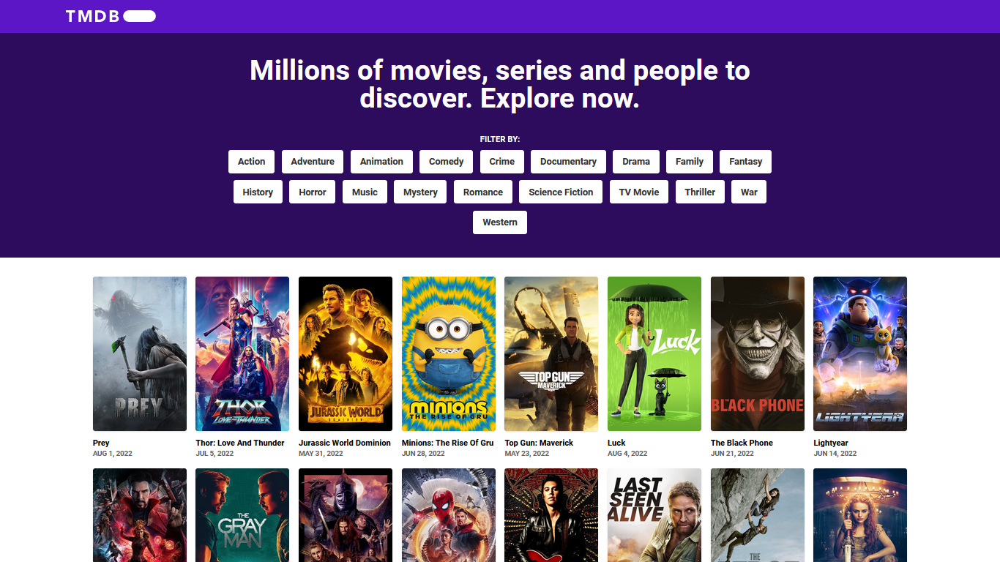

# 



## ✨ Tecnologias

- [Vite](https://vitejs.dev/)
- [Typescript](https://www.typescriptlang.org/)
- [Eslint](https://eslint.org/)
- [React](https://reactjs.org/)
- [React Router](https://reactrouter.com/)
- [React Icons](https://react-icons.github.io/react-icons/)
- [Tailwindcss](https://tailwindcss.com/)
- [Axios](https://github.com/axios/axios)
- [Swr](https://swr.vercel.app/)

## Como executar

Clone o projeto e acesse sua pasta

```bash
$ git clone https://github.com/wendson13/themoviedb-simplify-version.git
$ cd themoviedb-simplify-version
```

Instale as dependências e execute o projeto com yarn ou npm

```bash
# instalar dependências
$ yarn
  ou
$ npm i

# executar o projeto
$ yarn dev
  ou
$ npm run dev
```
acesse o projeto em [localhost:3000](http://localhost:3000) em seu navegador.

## 📌 Layout

layout usado no projeto no link abaixo

- [layout web](https://www.figma.com/file/rM7WPqhLY9ObnGzSCeWLxB/Teste-Front-End)

## 📝 License

Esse projeto está sob a licença MIT. Veja [LICENSE](LICENSE) para mais detalhes.
